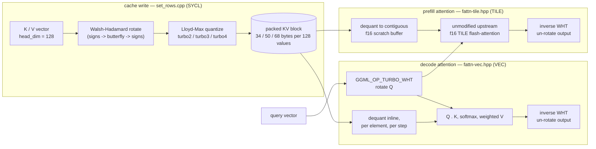

[English](README.md) | [Português (Brasil)](README.pt-BR.md)

# TurboQuant+ on SYCL — rotated low-bit KV cache for Intel GPUs

[](https://github.com/FellypeMelo/llama-cpp-turboquant-SYCL/actions/workflows/tqp-sycl.yml)
[](https://github.com/FellypeMelo/llama-cpp-turboquant-SYCL/releases)
[](https://opensource.org/licenses/MIT)

> Brings **TurboQuant** — 2/3/4-bit *rotated* KV-cache quantization — to the **SYCL backend for Intel GPUs** (Arc / Xe2). Up to **7.5× less KV-cache memory** than fp16, with **prefill at fp16 parity**, measured on an Intel Arc B580.

## Credit and scope

**TurboQuant is not this fork's invention.** The scheme — Walsh–Hadamard rotation followed by Lloyd–Max codebook quantization of the KV cache — and its original Metal and CUDA implementations were created by [**TheTom**](https://github.com/TheTom) and [**Gabe Ortiz**](https://github.com/signalnine), with further contributions from Sean, Tuklus-Labs, Simon Gardling and Nathan Maine, in [TheTom/llama-cpp-turboquant](https://github.com/TheTom/llama-cpp-turboquant). This repository is a fork of that project, which is itself a fork of [ggml-org/llama.cpp](https://github.com/ggml-org/llama.cpp).

**What this fork contributes** is the Intel side of it, across 16 commits to `ggml/src/ggml-sycl/`:

- the SYCL port of the turbo block formats, codebooks and WHT rotation kernels;
- a correctness fix to the WHT rotation that made flash-attention usable with a turbo KV cache at all;
- a prefill path that dequantizes to an f16 scratch buffer so the unmodified upstream f16 TILE kernel can run it, recovering roughly 3–7× over the naive path;
- asymmetric-precision dispatch, so K can stay at `q8_0`/`f16` while V goes low-bit;
- the golden numerical-parity test and the end-to-end coherence gate that keep the above honest on real hardware.

This is a personal engineering fork, not a general-purpose product, and it has not been merged upstream: it targets one backend (SYCL / Intel GPU) and is validated on one hardware/model combination (Arc B580, Qwen3-4B Q4_K_M). Everything below states exactly what was measured, on what, and links to the source doc — see the results table further down for the full picture, including the one known limitation (decode slows at depth, same as every other quantized KV format).

## Why it matters

For long-context inference the KV cache — not the model weights — is the memory wall. An fp16 KV cache for Qwen3-4B at 64k context is 9.2 GB, which alone nearly fills a 12 GB card. The common mitigation, `q8_0` KV, only halves it. TurboQuant compresses much harder: it rotates each key/value vector with a Walsh–Hadamard transform (an orthogonal outlier-smoother) *before* quantizing it, so a tiny 2–4-bit codebook reconstructs the vector near-losslessly.

## Architecture

TurboQuant is threaded through the `ggml` compute graph rather than folded inline into the attention kernel: the rotation is its own graph op (`GGML_OP_TURBO_WHT`), K/V are rotated once at cache-write time, and the query is rotated once per step before the attention score.



Decode reuses the existing memory-bound VEC kernel — dequantizing turbo K/V inline is what saves the memory, and is also why decode throughput tracks `q8_0`, not fp16, at depth. Prefill dequantizes turbo K/V to a contiguous f16 buffer and hands it to the unmodified, already-optimized f16 TILE kernel instead of a hand-written low-bit tile loader — that is why prefill lands at fp16 parity instead of the 3–7× slower path a naive turbo-native prefill kernel produced. Full rationale, the six correctness bugs this surfaced, and what was deliberately deferred: [`docs/en/architecture.md`](docs/en/architecture.md) ([pt-BR](docs/pt-BR/architecture.md)).

## Verified results — Intel Arc B580, Qwen3-4B Q4_K_M

All numbers below come from the maintainer's own `llama-bench` / `llama-cli` runs on that specific card and model, logged in [`docs/en/architecture.md`](docs/en/architecture.md) and [`docs/en/benchmarks.md`](docs/en/benchmarks.md); they have not been independently reproduced by a third party.

| Metric | f16 | q8_0 | **turbo3** | **turbo2** |
|--------|----:|-----:|-----------:|-----------:|
| KV cache @ 64k ctx (MiB) | 9216 | 4896 | **1800** | **1632** |
| Memory savings vs fp16 | 1× | 1.9× | **5.1×** | **5.6–7.5×** |
| Prefill pp512 (t/s) | 1267 | 1271 | **1244** | ✓ parity |
| Prefill pp8192 (t/s) | 580 | — | **577** | ✓ parity |
| Decode tg128 @ depth 0 (t/s) | 75.6 | 71.8 | **70.4** | — |

fp16 @64k nearly OOMs the 12 GB card; turbo runs the same 64k with 6+ GB free (~256k context reachable). Prefill matches fp16 at every length tested — see [Architecture](#architecture) for why.

**On the decode row — two runs, not one number:** the session behind this table measured f16 75.6 / q8_0 71.8 / turbo3 70.4 t/s at depth 0. A separate benchmark session, recorded in the deep-dive's own decode-at-depth table (`docs/en/architecture.md`, §6), measured the same metric on the same hardware and model as f16 75.9 / q8_0 72.3 / turbo3 70.8 — a ~0.3–0.5 t/s spread consistent with ordinary run-to-run noise between two separate `llama-bench` invocations, not a change in behavior. Both figures are real measurements; neither is presented here as the single "correct" one. What both runs agree on: turbo decode tracks `q8_0` closely at shallow context and, like `q8_0`, slows down at deep context. This is not a TurboQuant-specific regression - but it is also not, as this section previously claimed, an inherent property of quantized KV. The cause is structural routing: fp16 decode reaches the GQA-batched TILE kernel, which dequantizes each K/V row once and shares it across the whole GQA group, while every quantized type is forced onto the VEC kernel with `ncols2` hardcoded to 1 (`ggml/src/ggml-sycl/fattn-vec.hpp`), so VEC re-reads each row once per query head - about 4x the work at GQA 4:1. Addressable in principle, not yet addressed. See §6 of the deep-dive for the depth table.

**A separate build configuration roughly doubles prefill — labeled separately on purpose:** with `GGML_SYCL_F16=ON` plus ahead-of-time device compilation (`GGML_SYCL_DEVICE_ARCH=bmg-g21`), a 2026-07-09 benchmark measured baseline pp512 1246.70 ± 2.87 t/s vs. 2528.80 ± 18.62 t/s with those two flags on (+102.8%), with decode essentially flat (−3.3%, within noise) and the golden correctness test still green. That is a different binary than the one produced by the Quick start below and than the table above (`GGML_SYCL_F16` is off, and there is no AOT compile, in the default build) — see [`docs/en/benchmarks.md`](docs/en/benchmarks.md) and [`docs/en/testing.md`](docs/en/testing.md) for the exact flags and how to build it.

## Quick start

Download a pre-built self-contained package from the [**Releases page**](https://github.com/FellypeMelo/llama-cpp-turboquant-SYCL/releases) (Windows x64 bundles the oneAPI runtime — no install needed), then:

```bash
# Turbo KV cache — requires flash-attention. Types: turbo2 / turbo3 / turbo4
llama-server -m model.gguf -ngl 99 --flash-attn on \
             --cache-type-k q8_0 --cache-type-v turbo3 -c 32768
```

Keep **K** at `q8_0` and compress only **V**. Perplexity on wikitext-2 (Qwen3-4B Q4_K_M): this config
lands within **0.4%** of f16, while symmetric `-ctk turbo3 -ctv turbo3` costs **+31.7%** — quantizing
K is what hurts, and V is nearly free. Symmetric turbo maximizes memory savings and still generates
coherent text, which is why it was recommended here before the perplexity gate was ever run; do not
use it unless you have measured that the quality loss is acceptable for your task. Full numbers in
[docs/en/benchmarks.md](docs/en/benchmarks.md).

On Intel GPUs, set `SYCL_CACHE_PERSISTENT=1` once so the SYCL JIT caches compiled kernels to disk (first launch compiles all kernels).

**Build from source** (Windows, Intel oneAPI): `cmake -B build -G Ninja -DGGML_SYCL=ON -DCMAKE_C_COMPILER=cl -DCMAKE_CXX_COMPILER=icx -DCMAKE_BUILD_TYPE=Release && cmake --build build --config Release`.

## Testing & CI

Three gates protect the turbo KV-cache path, in increasing order of scope:

1. **Golden numerical-parity test** — [`tests/test-sycl-turbo.cpp`](tests/test-sycl-turbo.cpp), runs on-device via SYCL. Checks turbo2/turbo3/turbo4 quantize/dequantize, the WHT round-trip, `set_rows`, and flash-attention (including mixed-precision K/V) against an f16 reference by cosine similarity. Documented result on the maintainer's Arc B580: **34/34 PASSED, exit 0**.
2. **End-to-end coherence gate** — [`tests/test-e2e-turbo-kv.sh`](tests/test-e2e-turbo-kv.sh), wired into CTest as `test-e2e-turbo-kv` (labels `e2e;gpu;turbo`). Drives real `llama-cli` generation with the turbo KV cache enabled and checks the output stays on-topic and non-repetitive across the SYCL-safe symmetric and asymmetric type combinations. It needs a GPU and a local GGUF model, and exits 77 (skip) without either — so it is a no-op on GitHub-hosted CI and only a real gate on the maintainer's self-hosted Arc box.
3. **PPL / speed quality gate** — [`scripts/turbo-quality-gate.sh`](scripts/turbo-quality-gate.sh) (turbo3 perplexity within 1.05× of the `q8_0` baseline, speed ratio > 0.95 at 4K context). Exists and is wired up, but see [Roadmap](#roadmap): it has not yet been run end-to-end for lack of a locally available pure-attention reference model plus a `wikitext-2-raw` dataset in the sessions documented so far.
4. **CI/CD** — [`tqp-sycl.yml`](.github/workflows/tqp-sycl.yml) builds Windows and Linux SYCL binaries (including the `test-sycl-turbo` binary) on every push to `feature/turboquant-kv-cache` and on `tqp-sycl-v*` tags, publishing a GitHub Release with a self-contained Windows package on the latter. [`tqp-release.yml`](.github/workflows/tqp-release.yml) is a second, narrower packaging workflow gated on `tqp-v*` tags. **Neither hosted runner has an Intel GPU**: CI proves the build compiles and links (including gate 1's test binary), it does not execute gates 1–3 — those are run manually against real hardware.

Full build flags and the exact gate commands: [`docs/en/testing.md`](docs/en/testing.md).

## Project layout

Of roughly 3,100 tracked files, the large majority (`src/`, `ggml/`, `tools/`, `examples/`, the model conversion scripts, most of `docs/`) is unmodified upstream `llama.cpp`, and the Metal/CUDA turbo implementations come from the parent fork. This fork's own surface area is small and lives almost entirely under `ggml-sycl/`:

| Path | What's there |
|---|---|
| `ggml/src/ggml-sycl/turbo-quants.hpp`, `turbo-wht.cpp` | Turbo block formats, codebooks, the WHT rotation |
| `ggml/src/ggml-sycl/set_rows.cpp` | Cache-write kernel (rotate + quantize) |
| `ggml/src/ggml-sycl/fattn-vec.hpp`, `fattn-tile.hpp`, `fattn.cpp` | Decode (VEC) and prefill (TILE) attention dispatch |
| `ggml/src/ggml-metal/turbo-matrices.h` | Experimental Metal port of turbo2 (not part of the SYCL gates above) |
| `src/llama-kv-cache.cpp`, `src/llama-context.cpp` | Per-layer adaptive K/V type selection, asymmetric K/V hooks |
| `tests/test-sycl-turbo.cpp`, `tests/test-e2e-turbo-kv.sh` | The two turbo-specific test gates (see Testing & CI) |
| `.github/workflows/tqp-sycl.yml`, `tqp-release.yml` | Fork-specific CI/CD |
| [`docs/en/`](docs/en/) / [`docs/pt-BR/`](docs/pt-BR/) | Fork-owned documentation, bilingual: architecture deep-dive, ADR log, benchmarks, upstream-merge runbook, testing recipe, roadmap. See [`docs/README.md`](docs/README.md) for the index. |

Everything else follows the standard `llama.cpp` layout described in the unmodified README section below.

## Roadmap

Deliberately deferred or still open, per the engineering notes in [`docs/en/architecture.md`](docs/en/architecture.md) and the full [`docs/en/roadmap.md`](docs/en/roadmap.md):

- **PPL / speed quality gate** (`scripts/turbo-quality-gate.sh`) — **run for the first time on 2026-07-28** (wikitext-2, Qwen3-4B Q4_K_M, `-c 512 --chunks 32`) and it changed the recommended configuration: turbo on V costs ~0.4%, turbo on K ~30%. The numbers are in [`docs/en/benchmarks.md`](docs/en/benchmarks.md). It is not yet wired into a scheduled CI run on the Arc machine, so it remains a manual gate.
- **XMX (`joint_matrix`) prefill kernel** — a proof-of-concept confirmed Intel's matrix engine works for this on the B580 (one fp16→f32 DPAS tile, error 1e-10), but it is parked: prefill is already at fp16 parity via the dequant-to-f16 path, so the projected additional gain (~1.6% at pp512) does not currently justify the added kernel complexity.
- **Native head_dim=64 support and turbo K-shift** — scoped but not implemented. Context-shift on a turbo-quantized cache currently disables gracefully (`get_can_shift()` returns `false`) rather than crashing or being supported.
- **CUDA / Metal / Vulkan turbo support** — present in the codebase from earlier phases of this fork's history (see `ggml/src/ggml-metal/turbo-matrices.h` and the CUDA/Vulkan dispatch paths), but SYCL on Intel Arc is the only backend covered by the gates in Testing & CI; the other backends are best-effort and not currently re-validated on every sync.

Full roadmap, including gate-closure follow-ups and known backend regressions not summarized above: [`docs/en/roadmap.md`](docs/en/roadmap.md) ([pt-BR](docs/pt-BR/roadmap.md)).

## License

MIT, inherited unchanged from upstream `llama.cpp` — see [`LICENSE`](LICENSE). The TurboQuant-specific additions in this fork are contributed under the same terms; there is no separate license file or license terms for the fork's own code.

## Author

Fellype Samuel ([@FellypeMelo](https://github.com/FellypeMelo)) maintains this fork as a personal engineering project, and authored the SYCL/Intel-Arc work described under [Credit and scope](#credit-and-scope). TurboQuant itself belongs to the authors of [TheTom/llama-cpp-turboquant](https://github.com/TheTom/llama-cpp-turboquant); `llama.cpp` belongs to [ggml-org](https://github.com/ggml-org/llama.cpp).

Issues and pull requests about the SYCL turbo path are welcome on this repository. Issues about the turbo scheme itself belong to the parent fork, and issues about `llama.cpp` belong upstream.

---

<sub>The unmodified upstream <a href="https://github.com/ggml-org/llama.cpp">llama.cpp</a> README follows.</sub>

---

# llama.cpp


[](https://opensource.org/licenses/MIT)
[](https://github.com/ggml-org/llama.cpp/releases)
[](https://github.com/ggml-org/llama.cpp/actions/workflows/server.yml)
[](https://github.com/ggml-org/llama.cpp/actions/workflows/docker.yml)
[](https://github.com/ggml-org/llama.cpp/actions/workflows/winget.yml)

[Manifesto](https://github.com/ggml-org/llama.cpp/discussions/205) / [ggml](https://github.com/ggml-org/ggml) / [ops](https://github.com/ggml-org/llama.cpp/blob/master/docs/ops.md)

LLM inference in C/C++

## Recent API changes

- [Changelog for `libllama` API](https://github.com/ggml-org/llama.cpp/issues/9289)
- [Changelog for `llama-server` REST API](https://github.com/ggml-org/llama.cpp/issues/9291)

## Hot topics

- **Hugging Face cache migration: models downloaded with `-hf` are now stored in the standard Hugging Face cache directory, enabling sharing with other HF tools.**
- **[guide : using the new WebUI of llama.cpp](https://github.com/ggml-org/llama.cpp/discussions/16938)**
- [guide : running gpt-oss with llama.cpp](https://github.com/ggml-org/llama.cpp/discussions/15396)
- [[FEEDBACK] Better packaging for llama.cpp to support downstream consumers 🤗](https://github.com/ggml-org/llama.cpp/discussions/15313)
- Support for the `gpt-oss` model with native MXFP4 format has been added | [PR](https://github.com/ggml-org/llama.cpp/pull/15091) | [Collaboration with NVIDIA](https://blogs.nvidia.com/blog/rtx-ai-garage-openai-oss) | [Comment](https://github.com/ggml-org/llama.cpp/discussions/15095)
- Multimodal support arrived in `llama-server`: [#12898](https://github.com/ggml-org/llama.cpp/pull/12898) | [documentation](./docs/multimodal.md)
- VS Code extension for FIM completions: https://github.com/ggml-org/llama.vscode
- Vim/Neovim plugin for FIM completions: https://github.com/ggml-org/llama.vim
- Hugging Face Inference Endpoints now support GGUF out of the box! https://github.com/ggml-org/llama.cpp/discussions/9669
- Hugging Face GGUF editor: [discussion](https://github.com/ggml-org/llama.cpp/discussions/9268) | [tool](https://huggingface.co/spaces/CISCai/gguf-editor)
- WebGPU support is now available in the browser, see a blog/demo introducing it [here](https://reeselevine.github.io/llamas-on-the-web/).

----

## Quick start

Getting started with llama.cpp is straightforward. Here are several ways to install it on your machine:

- Install `llama.cpp` using [brew, nix, winget, or conda-forge](docs/install.md)
- Run with Docker - see our [Docker documentation](docs/docker.md)
- Download pre-built binaries from the [releases page](https://github.com/ggml-org/llama.cpp/releases)
- Build from source by cloning this repository - check out [our build guide](docs/build.md)

Once installed, you'll need a model to work with. Head to the [Obtaining and quantizing models](#obtaining-and-quantizing-models) section to learn more.

Example command:

```sh
# Use a local model file
llama-cli -m my_model.gguf

# Or download and run a model directly from Hugging Face
llama-cli -hf ggml-org/gemma-3-1b-it-GGUF

# Launch OpenAI-compatible API server
llama-server -hf ggml-org/gemma-3-1b-it-GGUF
```

## Description

The main goal of `llama.cpp` is to enable LLM inference with minimal setup and state-of-the-art performance on a wide
range of hardware - locally and in the cloud.

- Plain C/C++ implementation without any dependencies
- Apple silicon is a first-class citizen - optimized via ARM NEON, Accelerate and Metal frameworks
- AVX, AVX2, AVX512 and AMX support for x86 architectures
- RVV, ZVFH, ZFH, ZICBOP and ZIHINTPAUSE support for RISC-V architectures
- 1.5-bit, 2-bit, 3-bit, 4-bit, 5-bit, 6-bit, and 8-bit integer quantization for faster inference and reduced memory use
- Custom CUDA kernels for running LLMs on NVIDIA GPUs (support for AMD GPUs via HIP and Moore Threads GPUs via MUSA)
- Vulkan and SYCL backend support
- CPU+GPU hybrid inference to partially accelerate models larger than the total VRAM capacity

The `llama.cpp` project is the main playground for developing new features for the [ggml](https://github.com/ggml-org/ggml) library.

<details>
<summary>Models</summary>

Typically finetunes of the base models below are supported as well.

Instructions for adding support for new models: [HOWTO-add-model.md](docs/development/HOWTO-add-model.md)

#### Text-only

- [X] LLaMA 🦙
- [x] LLaMA 2 🦙🦙
- [x] LLaMA 3 🦙🦙🦙
- [X] [Mistral 7B](https://huggingface.co/mistralai/Mistral-7B-v0.1)
- [x] [Mixtral MoE](https://huggingface.co/models?search=mistral-ai/Mixtral)
- [x] [DBRX](https://huggingface.co/databricks/dbrx-instruct)
- [x] [Jamba](https://huggingface.co/ai21labs)
- [X] [Falcon](https://huggingface.co/models?search=tiiuae/falcon)
- [X] [Chinese LLaMA / Alpaca](https://github.com/ymcui/Chinese-LLaMA-Alpaca) and [Chinese LLaMA-2 / Alpaca-2](https://github.com/ymcui/Chinese-LLaMA-Alpaca-2)
- [X] [Vigogne (French)](https://github.com/bofenghuang/vigogne)
- [X] [BERT](https://github.com/ggml-org/llama.cpp/pull/5423)
- [X] [Koala](https://bair.berkeley.edu/blog/2023/04/03/koala/)
- [X] [Baichuan 1 & 2](https://huggingface.co/models?search=baichuan-inc/Baichuan) + [derivations](https://huggingface.co/hiyouga/baichuan-7b-sft)
- [X] [Aquila 1 & 2](https://huggingface.co/models?search=BAAI/Aquila)
- [X] [Starcoder models](https://github.com/ggml-org/llama.cpp/pull/3187)
- [X] [Refact](https://huggingface.co/smallcloudai/Refact-1_6B-fim)
- [X] [MPT](https://github.com/ggml-org/llama.cpp/pull/3417)
- [X] [Bloom](https://github.com/ggml-org/llama.cpp/pull/3553)
- [x] [Yi models](https://huggingface.co/models?search=01-ai/Yi)
- [X] [StableLM models](https://huggingface.co/stabilityai)
- [x] [Deepseek models](https://huggingface.co/models?search=deepseek-ai/deepseek)
- [x] [Qwen models](https://huggingface.co/models?search=Qwen/Qwen)
- [x] [PLaMo-13B](https://github.com/ggml-org/llama.cpp/pull/3557)
- [x] [Phi models](https://huggingface.co/models?search=microsoft/phi)
- [x] [PhiMoE](https://github.com/ggml-org/llama.cpp/pull/11003)
- [x] [GPT-2](https://huggingface.co/gpt2)
- [x] [Orion 14B](https://github.com/ggml-org/llama.cpp/pull/5118)
- [x] [InternLM2](https://huggingface.co/models?search=internlm2)
- [x] [CodeShell](https://github.com/WisdomShell/codeshell)
- [x] [Gemma](https://ai.google.dev/gemma)
- [x] [Mamba](https://github.com/state-spaces/mamba)
- [x] [Grok-1](https://huggingface.co/keyfan/grok-1-hf)
- [x] [Xverse](https://huggingface.co/models?search=xverse)
- [x] [Command-R models](https://huggingface.co/models?search=CohereForAI/c4ai-command-r)
- [x] [SEA-LION](https://huggingface.co/models?search=sea-lion)
- [x] [GritLM-7B](https://huggingface.co/GritLM/GritLM-7B) + [GritLM-8x7B](https://huggingface.co/GritLM/GritLM-8x7B)
- [x] [OLMo](https://allenai.org/olmo)
- [x] [OLMo 2](https://allenai.org/olmo)
- [x] [OLMoE](https://huggingface.co/allenai/OLMoE-1B-7B-0924)
- [x] [Granite models](https://huggingface.co/collections/ibm-granite/granite-code-models-6624c5cec322e4c148c8b330)
- [x] [GPT-NeoX](https://github.com/EleutherAI/gpt-neox) + [Pythia](https://github.com/EleutherAI/pythia)
- [x] [Snowflake-Arctic MoE](https://huggingface.co/collections/Snowflake/arctic-66290090abe542894a5ac520)
- [x] [Smaug](https://huggingface.co/models?search=Smaug)
- [x] [Poro 34B](https://huggingface.co/LumiOpen/Poro-34B)
- [x] [Bitnet b1.58 models](https://huggingface.co/1bitLLM)
- [x] [Flan T5](https://huggingface.co/models?search=flan-t5)
- [x] [Open Elm models](https://huggingface.co/collections/apple/openelm-instruct-models-6619ad295d7ae9f868b759ca)
- [x] [ChatGLM3-6b](https://huggingface.co/THUDM/chatglm3-6b) + [ChatGLM4-9b](https://huggingface.co/THUDM/glm-4-9b) + [GLMEdge-1.5b](https://huggingface.co/THUDM/glm-edge-1.5b-chat) + [GLMEdge-4b](https://huggingface.co/THUDM/glm-edge-4b-chat)
- [x] [GLM-4-0414](https://huggingface.co/collections/THUDM/glm-4-0414-67f3cbcb34dd9d252707cb2e)
- [x] [SmolLM](https://huggingface.co/collections/HuggingFaceTB/smollm-6695016cad7167254ce15966)
- [x] [EXAONE-3.0-7.8B-Instruct](https://huggingface.co/LGAI-EXAONE/EXAONE-3.0-7.8B-Instruct)
- [x] [FalconMamba Models](https://huggingface.co/collections/tiiuae/falconmamba-7b-66b9a580324dd1598b0f6d4a)
- [x] [Jais](https://huggingface.co/inceptionai/jais-13b-chat)
- [x] [Bielik-11B-v2.3](https://huggingface.co/collections/speakleash/bielik-11b-v23-66ee813238d9b526a072408a)
- [x] [RWKV-7](https://huggingface.co/collections/shoumenchougou/rwkv7-gxx-gguf)
- [x] [RWKV-6](https://github.com/BlinkDL/RWKV-LM)
- [x] [QRWKV-6](https://huggingface.co/recursal/QRWKV6-32B-Instruct-Preview-v0.1)
- [x] [GigaChat-20B-A3B](https://huggingface.co/ai-sage/GigaChat-20B-A3B-instruct)
- [X] [Trillion-7B-preview](https://huggingface.co/trillionlabs/Trillion-7B-preview)
- [x] [Ling models](https://huggingface.co/collections/inclusionAI/ling-67c51c85b34a7ea0aba94c32)
- [x] [Liquid LFM2 models](https://huggingface.co/collections/LiquidAI/lfm2)
- [x] [Liquid LFM2.5 models](https://huggingface.co/collections/LiquidAI/lfm25)
- [x] [Liquid Nanos](https://huggingface.co/collections/LiquidAI/liquid-nanos)
- [x] [Hunyuan models](https://huggingface.co/collections/tencent/hunyuan-dense-model-6890632cda26b19119c9c5e7)
- [x] [BailingMoeV2 (Ring/Ling 2.0) models](https://huggingface.co/collections/inclusionAI/ling-v2-68bf1dd2fc34c306c1fa6f86)
- [x] [Mellum models](https://huggingface.co/JetBrains/models?search=mellum)

#### Multimodal

- [x] [LLaVA 1.5 models](https://huggingface.co/collections/liuhaotian/llava-15-653aac15d994e992e2677a7e), [LLaVA 1.6 models](https://huggingface.co/collections/liuhaotian/llava-16-65b9e40155f60fd046a5ccf2)
- [x] [BakLLaVA](https://huggingface.co/models?search=SkunkworksAI/Bakllava)
- [x] [Obsidian](https://huggingface.co/NousResearch/Obsidian-3B-V0.5)
- [x] [ShareGPT4V](https://huggingface.co/models?search=Lin-Chen/ShareGPT4V)
- [x] [MobileVLM 1.7B/3B models](https://huggingface.co/models?search=mobileVLM)
- [x] [Yi-VL](https://huggingface.co/models?search=Yi-VL)
- [x] [Mini CPM](https://huggingface.co/models?search=MiniCPM)
- [x] [Moondream](https://huggingface.co/vikhyatk/moondream2)
- [x] [Bunny](https://github.com/BAAI-DCAI/Bunny)
- [x] [GLM-EDGE](https://huggingface.co/models?search=glm-edge)
- [x] [Qwen2-VL](https://huggingface.co/collections/Qwen/qwen2-vl-66cee7455501d7126940800d)
- [x] [LFM2-VL](https://huggingface.co/collections/LiquidAI/lfm2-vl-68963bbc84a610f7638d5ffa)

</details>

<details>
<summary>Bindings</summary>

- Python: [ddh0/easy-llama](https://github.com/ddh0/easy-llama)
- Python: [abetlen/llama-cpp-python](https://github.com/abetlen/llama-cpp-python)
- Go: [go-skynet/go-llama.cpp](https://github.com/go-skynet/go-llama.cpp)
- Node.js: [withcatai/node-llama-cpp](https://github.com/withcatai/node-llama-cpp)
- JS/TS (llama.cpp server client): [lgrammel/modelfusion](https://modelfusion.dev/integration/model-provider/llamacpp)
- JS/TS (Programmable Prompt Engine CLI): [offline-ai/cli](https://github.com/offline-ai/cli)
- JavaScript/Wasm (works in browser): [tangledgroup/llama-cpp-wasm](https://github.com/tangledgroup/llama-cpp-wasm)
- Typescript/Wasm (nicer API, available on npm): [ngxson/wllama](https://github.com/ngxson/wllama)
- Ruby: [yoshoku/llama_cpp.rb](https://github.com/yoshoku/llama_cpp.rb)
- Ruby: [docusealco/rllama](https://github.com/docusealco/rllama)
- Rust (more features): [edgenai/llama_cpp-rs](https://github.com/edgenai/llama_cpp-rs)
- Rust (nicer API): [mdrokz/rust-llama.cpp](https://github.com/mdrokz/rust-llama.cpp)
- Rust (more direct bindings): [utilityai/llama-cpp-rs](https://github.com/utilityai/llama-cpp-rs)
- Rust (automated build from crates.io): [ShelbyJenkins/llm_client](https://github.com/ShelbyJenkins/llm_client)
- C#/.NET: [SciSharp/LLamaSharp](https://github.com/SciSharp/LLamaSharp)
- C#/VB.NET (more features - community license): [LM-Kit.NET](https://docs.lm-kit.com/lm-kit-net/index.html)
- Scala 3: [donderom/llm4s](https://github.com/donderom/llm4s)
- Clojure: [phronmophobic/llama.clj](https://github.com/phronmophobic/llama.clj)
- React Native: [mybigday/llama.rn](https://github.com/mybigday/llama.rn)
- Java: [kherud/java-llama.cpp](https://github.com/kherud/java-llama.cpp)
- Java: [QuasarByte/llama-cpp-jna](https://github.com/QuasarByte/llama-cpp-jna)
- Zig: [deins/llama.cpp.zig](https://github.com/Deins/llama.cpp.zig)
- Flutter/Dart: [netdur/llama_cpp_dart](https://github.com/netdur/llama_cpp_dart)
- Flutter: [xuegao-tzx/Fllama](https://github.com/xuegao-tzx/Fllama)
- PHP (API bindings and features built on top of llama.cpp): [distantmagic/resonance](https://github.com/distantmagic/resonance) [(more info)](https://github.com/ggml-org/llama.cpp/pull/6326)
- Guile Scheme: [guile_llama_cpp](https://savannah.nongnu.org/projects/guile-llama-cpp)
- Swift [srgtuszy/llama-cpp-swift](https://github.com/srgtuszy/llama-cpp-swift)
- Swift [ShenghaiWang/SwiftLlama](https://github.com/ShenghaiWang/SwiftLlama)
- Delphi [Embarcadero/llama-cpp-delphi](https://github.com/Embarcadero/llama-cpp-delphi)
- Go (no CGo needed): [hybridgroup/yzma](https://github.com/hybridgroup/yzma)
- Android: [llama.android](/examples/llama.android)

</details>

<details>
<summary>UIs</summary>

*(to have a project listed here, it should clearly state that it depends on `llama.cpp`)*

- [AI Sublime Text plugin](https://github.com/yaroslavyaroslav/OpenAI-sublime-text) (MIT)
- [BonzAI App](https://apps.apple.com/us/app/bonzai-your-local-ai-agent/id6752847988) (proprietary)
- [cztomsik/ava](https://github.com/cztomsik/ava) (MIT)
- [Dot](https://github.com/alexpinel/Dot) (GPL)
- [eva](https://github.com/ylsdamxssjxxdd/eva) (MIT)
- [iohub/collama](https://github.com/iohub/coLLaMA) (Apache-2.0)
- [janhq/jan](https://github.com/janhq/jan) (AGPL)
- [johnbean393/Sidekick](https://github.com/johnbean393/Sidekick) (MIT)
- [KanTV](https://github.com/zhouwg/kantv?tab=readme-ov-file) (Apache-2.0)
- [KodiBot](https://github.com/firatkiral/kodibot) (GPL)
- [llama.vim](https://github.com/ggml-org/llama.vim) (MIT)
- [LARS](https://github.com/abgulati/LARS) (AGPL)
- [Llama Assistant](https://github.com/vietanhdev/llama-assistant) (GPL)
- [LlamaLib](https://github.com/undreamai/LlamaLib) (Apache-2.0)
- [LLMFarm](https://github.com/guinmoon/LLMFarm?tab=readme-ov-file) (MIT)
- [LLMUnity](https://github.com/undreamai/LLMUnity) (MIT)
- [LMStudio](https://lmstudio.ai/) (proprietary)
- [LocalAI](https://github.com/mudler/LocalAI) (MIT)
- [LostRuins/koboldcpp](https://github.com/LostRuins/koboldcpp) (AGPL)
- [MindMac](https://mindmac.app) (proprietary)
- [MindWorkAI/AI-Studio](https://github.com/MindWorkAI/AI-Studio) (FSL-1.1-MIT)
- [Mobile-Artificial-Intelligence/maid](https://github.com/Mobile-Artificial-Intelligence/maid) (MIT)
- [Mozilla-Ocho/llamafile](https://github.com/Mozilla-Ocho/llamafile) (Apache-2.0)
- [nat/openplayground](https://github.com/nat/openplayground) (MIT)
- [nomic-ai/gpt4all](https://github.com/nomic-ai/gpt4all) (MIT)
- [ollama/ollama](https://github.com/ollama/ollama) (MIT)
- [oobabooga/text-generation-webui](https://github.com/oobabooga/text-generation-webui) (AGPL)
- [PocketPal AI](https://github.com/a-ghorbani/pocketpal-ai) (MIT)
- [psugihara/FreeChat](https://github.com/psugihara/FreeChat) (MIT)
- [ptsochantaris/emeltal](https://github.com/ptsochantaris/emeltal) (MIT)
- [pythops/tenere](https://github.com/pythops/tenere) (AGPL)
- [ramalama](https://github.com/containers/ramalama) (MIT)
- [semperai/amica](https://github.com/semperai/amica) (MIT)
- [withcatai/catai](https://github.com/withcatai/catai) (MIT)
- [Autopen](https://github.com/blackhole89/autopen) (GPL)

</details>

<details>
<summary>Tools</summary>

- [akx/ggify](https://github.com/akx/ggify) – download PyTorch models from Hugging Face Hub and convert them to GGML
- [akx/ollama-dl](https://github.com/akx/ollama-dl) – download models from the Ollama library to be used directly with llama.cpp
- [crashr/gppm](https://github.com/crashr/gppm) – launch llama.cpp instances utilizing NVIDIA Tesla P40 or P100 GPUs with reduced idle power consumption
- [gpustack/gguf-parser](https://github.com/gpustack/gguf-parser-go/tree/main/cmd/gguf-parser) - review/check the GGUF file and estimate the memory usage
- [Styled Lines](https://marketplace.unity.com/packages/tools/generative-ai/styled-lines-llama-cpp-model-292902) (proprietary licensed, async wrapper of inference part for game development in Unity3d with pre-built Mobile and Web platform wrappers and a model example)
- [unslothai/unsloth](https://github.com/unslothai/unsloth) – 🦥 exports/saves fine-tuned and trained models to GGUF (Apache-2.0)

</details>

<details>
<summary>Infrastructure</summary>

- [Paddler](https://github.com/intentee/paddler) - Open-source LLMOps platform for hosting and scaling AI in your own infrastructure
- [GPUStack](https://github.com/gpustack/gpustack) - Manage GPU clusters for running LLMs
- [llama_cpp_canister](https://github.com/onicai/llama_cpp_canister) - llama.cpp as a smart contract on the Internet Computer, using WebAssembly
- [llama-swap](https://github.com/mostlygeek/llama-swap) - transparent proxy that adds automatic model switching with llama-server
- [Kalavai](https://github.com/kalavai-net/kalavai-client) - Crowdsource end to end LLM deployment at any scale
- [llmaz](https://github.com/InftyAI/llmaz) - ☸️ Easy, advanced inference platform for large language models on Kubernetes.
- [LLMKube](https://github.com/defilantech/llmkube) - Kubernetes operator for llama.cpp with multi-GPU and Apple Silicon Metal
  support"
</details>

<details>
<summary>Games</summary>

- [Lucy's Labyrinth](https://github.com/MorganRO8/Lucys_Labyrinth) - A simple maze game where agents controlled by an AI model will try to trick you.

</details>


## Supported backends

| Backend | Target devices |
| --- | --- |
| [Metal](docs/build.md#metal-build) | Apple Silicon |
| [BLAS](docs/build.md#blas-build) | All |
| [BLIS](docs/backend/BLIS.md) | All |
| [SYCL](docs/backend/SYCL.md) | Intel GPU |
| [OpenVINO [In Progress]](docs/backend/OPENVINO.md) | Intel CPUs, GPUs, and NPUs |
| [MUSA](docs/build.md#musa) | Moore Threads GPU |
| [CUDA](docs/build.md#cuda) | Nvidia GPU |
| [HIP](docs/build.md#hip) | AMD GPU |
| [ZenDNN](docs/build.md#zendnn) | AMD CPU |
| [Vulkan](docs/build.md#vulkan) | GPU |
| [CANN](docs/build.md#cann) | Ascend NPU |
| [OpenCL](docs/backend/OPENCL.md) | Adreno GPU |
| [IBM zDNN](docs/backend/zDNN.md) | IBM Z & LinuxONE |
| [WebGPU](docs/build.md#webgpu) | All |
| [RPC](https://github.com/ggml-org/llama.cpp/tree/master/tools/rpc) | All |
| [Hexagon [In Progress]](docs/backend/snapdragon/README.md) | Snapdragon |
| [VirtGPU](docs/backend/VirtGPU.md) | VirtGPU APIR |

## Obtaining and quantizing models

The [Hugging Face](https://huggingface.co) platform hosts a [number of LLMs](https://huggingface.co/models?library=gguf&sort=trending) compatible with `llama.cpp`:

- [Trending](https://huggingface.co/models?library=gguf&sort=trending)
- [LLaMA](https://huggingface.co/models?sort=trending&search=llama+gguf)

You can either manually download the GGUF file or directly use any `llama.cpp`-compatible models from [Hugging Face](https://huggingface.co/) or other model hosting sites, by using this CLI argument: `-hf <user>/<model>[:quant]`. For example:

```sh
llama-cli -hf ggml-org/gemma-3-1b-it-GGUF
```

By default, the CLI would download from Hugging Face, you can switch to other options with the environment variable `MODEL_ENDPOINT`. The `MODEL_ENDPOINT` must point to a Hugging Face compatible API endpoint.

After downloading a model, use the CLI tools to run it locally - see below.

`llama.cpp` requires the model to be stored in the [GGUF](https://github.com/ggml-org/ggml/blob/master/docs/gguf.md) file format. Models in other data formats can be converted to GGUF using the `convert_*.py` Python scripts in this repo.

The Hugging Face platform provides a variety of online tools for converting, quantizing and hosting models with `llama.cpp`:

- Use the [GGUF-my-repo space](https://huggingface.co/spaces/ggml-org/gguf-my-repo) to convert to GGUF format and quantize model weights to smaller sizes
- Use the [GGUF-my-LoRA space](https://huggingface.co/spaces/ggml-org/gguf-my-lora) to convert LoRA adapters to GGUF format (more info: https://github.com/ggml-org/llama.cpp/discussions/10123)
- Use the [GGUF-editor space](https://huggingface.co/spaces/CISCai/gguf-editor) to edit GGUF meta data in the browser (more info: https://github.com/ggml-org/llama.cpp/discussions/9268)
- Use the [Inference Endpoints](https://ui.endpoints.huggingface.co/) to directly host `llama.cpp` in the cloud (more info: https://github.com/ggml-org/llama.cpp/discussions/9669)

To learn more about model quantization, [read this documentation](tools/quantize/README.md)

## [`llama-cli`](tools/cli)

#### A CLI tool for accessing and experimenting with most of `llama.cpp`'s functionality.

- <details open>
    <summary>Run in conversation mode</summary>

    Models with a built-in chat template will automatically activate conversation mode. If this doesn't occur, you can manually enable it by adding `-cnv` and specifying a suitable chat template with `--chat-template NAME`

    ```bash
    llama-cli -m model.gguf

    # > hi, who are you?
    # Hi there! I'm your helpful assistant! I'm an AI-powered chatbot designed to assist and provide information to users like you. I'm here to help answer your questions, provide guidance, and offer support on a wide range of topics. I'm a friendly and knowledgeable AI, and I'm always happy to help with anything you need. What's on your mind, and how can I assist you today?
    #
    # > what is 1+1?
    # Easy peasy! The answer to 1+1 is... 2!
    ```

    </details>

- <details>
    <summary>Run in conversation mode with custom chat template</summary>

    ```bash
    # use the "chatml" template (use -h to see the list of supported templates)
    llama-cli -m model.gguf -cnv --chat-template chatml

    # use a custom template
    llama-cli -m model.gguf -cnv --in-prefix 'User: ' --reverse-prompt 'User:'
    ```

    </details>

- <details>
    <summary>Constrain the output with a custom grammar</summary>

    ```bash
    llama-cli -m model.gguf -n 256 --grammar-file grammars/json.gbnf -p 'Request: schedule a call at 8pm; Command:'

    # {"appointmentTime": "8pm", "appointmentDetails": "schedule a a call"}
    ```

    The [grammars/](grammars/) folder contains a handful of sample grammars. To write your own, check out the [GBNF Guide](grammars/README.md).

    For authoring more complex JSON grammars, check out https://grammar.intrinsiclabs.ai/

    </details>


## [`llama-server`](tools/server)

#### A lightweight, [OpenAI API](https://github.com/openai/openai-openapi) compatible, HTTP server for serving LLMs.

- <details open>
    <summary>Start a local HTTP server with default configuration on port 8080</summary>

    ```bash
    llama-server -m model.gguf --port 8080

    # Basic web UI can be accessed via browser: http://localhost:8080
    # Chat completion endpoint: http://localhost:8080/v1/chat/completions
    ```

    </details>

- <details>
    <summary>Support multiple-users and parallel decoding</summary>

    ```bash
    # up to 4 concurrent requests, each with 4096 max context
    llama-server -m model.gguf -c 16384 -np 4
    ```

    </details>

- <details>
    <summary>Enable speculative decoding</summary>

    ```bash
    # the draft.gguf model should be a small variant of the target model.gguf
    llama-server -m model.gguf -md draft.gguf
    ```

    </details>

- <details>
    <summary>Serve an embedding model</summary>

    ```bash
    # use the /embedding endpoint
    llama-server -m model.gguf --embedding --pooling cls -ub 8192
    ```

    </details>

- <details>
    <summary>Serve a reranking model</summary>

    ```bash
    # use the /reranking endpoint
    llama-server -m model.gguf --reranking
    ```

    </details>

- <details>
    <summary>Constrain all outputs with a grammar</summary>

    ```bash
    # custom grammar
    llama-server -m model.gguf --grammar-file grammar.gbnf

    # JSON
    llama-server -m model.gguf --grammar-file grammars/json.gbnf
    ```

    </details>


## [`llama-perplexity`](tools/perplexity)

#### A tool for measuring the [perplexity](tools/perplexity/README.md) [^1] (and other quality metrics) of a model over a given text.

- <details open>
    <summary>Measure the perplexity over a text file</summary>

    ```bash
    llama-perplexity -m model.gguf -f file.txt

    # [1]15.2701,[2]5.4007,[3]5.3073,[4]6.2965,[5]5.8940,[6]5.6096,[7]5.7942,[8]4.9297, ...
    # Final estimate: PPL = 5.4007 +/- 0.67339
    ```

    </details>

- <details>
    <summary>Measure KL divergence</summary>

    ```bash
    # TODO
    ```

    </details>

[^1]: [https://huggingface.co/docs/transformers/perplexity](https://huggingface.co/docs/transformers/perplexity)

## [`llama-bench`](tools/llama-bench)

#### Benchmark the performance of the inference for various parameters.

- <details open>
    <summary>Run default benchmark</summary>

    ```bash
    llama-bench -m model.gguf

    # Output:
    # | model               |       size |     params | backend    | threads |          test |                  t/s |
    # | ------------------- | ---------: | ---------: | ---------- | ------: | ------------: | -------------------: |
    # | qwen2 1.5B Q4_0     | 885.97 MiB |     1.54 B | Metal,BLAS |      16 |         pp512 |      5765.41 ± 20.55 |
    # | qwen2 1.5B Q4_0     | 885.97 MiB |     1.54 B | Metal,BLAS |      16 |         tg128 |        197.71 ± 0.81 |
    #
    # build: 3e0ba0e60 (4229)
    ```

    </details>

## [`llama-simple`](examples/simple)

#### A minimal example for implementing apps with `llama.cpp`. Useful for developers.

- <details>
    <summary>Basic text completion</summary>

    ```bash
    llama-simple -m model.gguf

    # Hello my name is Kaitlyn and I am a 16 year old girl. I am a junior in high school and I am currently taking a class called "The Art of
    ```

    </details>


## Contributing

- Contributors can open PRs
- Collaborators will be invited based on contributions
- Maintainers can push to branches in the `llama.cpp` repo and merge PRs into the `master` branch
- Any help with managing issues, PRs and projects is very appreciated!
- See [good first issues](https://github.com/ggml-org/llama.cpp/issues?q=is%3Aissue+is%3Aopen+label%3A%22good+first+issue%22) for tasks suitable for first contributions
- Read the [CONTRIBUTING.md](CONTRIBUTING.md) for more information
- Make sure to read this: [Inference at the edge](https://github.com/ggml-org/llama.cpp/discussions/205)
- A bit of backstory for those who are interested: [Changelog podcast](https://changelog.com/podcast/532)

## Other documentation

- [cli](tools/cli/README.md)
- [completion](tools/completion/README.md)
- [server](tools/server/README.md)
- [GBNF grammars](grammars/README.md)

#### Development documentation

- [How to build](docs/build.md)
- [Running on Docker](docs/docker.md)
- [Build on Android](docs/android.md)
- [Multi-GPU usage](docs/multi-gpu.md)
- [Performance troubleshooting](docs/development/token_generation_performance_tips.md)
- [GGML tips & tricks](https://github.com/ggml-org/llama.cpp/wiki/GGML-Tips-&-Tricks)

#### Seminal papers and background on the models

If your issue is with model generation quality, then please at least scan the following links and papers to understand the limitations of LLaMA models. This is especially important when choosing an appropriate model size and appreciating both the significant and subtle differences between LLaMA models and ChatGPT:
- LLaMA:
    - [Introducing LLaMA: A foundational, 65-billion-parameter large language model](https://ai.facebook.com/blog/large-language-model-llama-meta-ai/)
    - [LLaMA: Open and Efficient Foundation Language Models](https://arxiv.org/abs/2302.13971)
- GPT-3
    - [Language Models are Few-Shot Learners](https://arxiv.org/abs/2005.14165)
- GPT-3.5 / InstructGPT / ChatGPT:
    - [Aligning language models to follow instructions](https://openai.com/research/instruction-following)
    - [Training language models to follow instructions with human feedback](https://arxiv.org/abs/2203.02155)

## XCFramework
The XCFramework is a precompiled version of the library for iOS, visionOS, tvOS,
and macOS. It can be used in Swift projects without the need to compile the
library from source. For example:
```swift
// swift-tools-version: 5.10
// The swift-tools-version declares the minimum version of Swift required to build this package.

import PackageDescription

let package = Package(
    name: "MyLlamaPackage",
    targets: [
        .executableTarget(
            name: "MyLlamaPackage",
            dependencies: [
                "LlamaFramework"
            ]),
        .binaryTarget(
            name: "LlamaFramework",
            url: "https://github.com/ggml-org/llama.cpp/releases/download/b5046/llama-b5046-xcframework.zip",
            checksum: "c19be78b5f00d8d29a25da41042cb7afa094cbf6280a225abe614b03b20029ab"
        )
    ]
)
```
The above example is using an intermediate build `b5046` of the library. This can be modified
to use a different version by changing the URL and checksum.

## Completions
Command-line completion is available for some environments.

#### Bash Completion
```bash
$ build/bin/llama-cli --completion-bash > ~/.llama-completion.bash
$ source ~/.llama-completion.bash
```
Optionally this can be added to your `.bashrc` or `.bash_profile` to load it
automatically. For example:
```console
$ echo "source ~/.llama-completion.bash" >> ~/.bashrc
```

## Dependencies

- [yhirose/cpp-httplib](https://github.com/yhirose/cpp-httplib) - Single-header HTTP server, used by `llama-server` - MIT license
- [stb-image](https://github.com/nothings/stb) - Single-header image format decoder, used by multimodal subsystem - Public domain
- [nlohmann/json](https://github.com/nlohmann/json) - Single-header JSON library, used by various tools/examples - MIT License
- [miniaudio.h](https://github.com/mackron/miniaudio) - Single-header audio format decoder, used by multimodal subsystem - Public domain
- [subprocess.h](https://github.com/sheredom/subprocess.h) - Single-header process launching solution for C and C++ - Public domain
