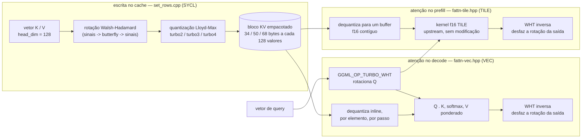

[English](README.md) | [Português (Brasil)](README.pt-BR.md)

# TurboQuant+ on SYCL — cache KV rotacionado de baixa precisão para GPUs Intel

[](https://github.com/FellypeMelo/llama-cpp-turboquant-SYCL/actions/workflows/tqp-sycl.yml)
[](https://github.com/FellypeMelo/llama-cpp-turboquant-SYCL/releases)
[](https://opensource.org/licenses/MIT)

> Um fork do `llama.cpp` que adiciona o **TurboQuant** — quantização *rotacionada* de 2/3/4 bits para o cache KV — ao **backend SYCL para GPUs Intel** (Arc / Xe2). Até **7,5× menos memória de cache KV** que fp16, com **prefill em paridade com fp16**, medido em uma Intel Arc B580.

> **Nota sobre este README:** esta página traduz apenas a parte que este fork realmente possui — o texto abaixo até a seção "Autor". O `llama.cpp` original (lista de modelos suportados, backends, ferramentas `llama-cli`/`llama-server`, bindings etc.) não é traduzido aqui para não duplicar ~550 linhas de conteúdo que pertencem ao projeto upstream, congelado e mantido em inglês. Para essa parte, veja o [`README.md`](README.md) em inglês, a partir da seção `# llama.cpp`.

Este é um fork de engenharia pessoal, não um produto de uso geral: ele cobre um único backend (SYCL / GPU Intel) e está validado em uma única combinação de hardware/modelo (Arc B580, Qwen3-4B Q4_K_M). Tudo abaixo declara exatamente o que foi medido, em qual configuração, e aponta para o documento-fonte — veja a tabela de resultados mais adiante para o quadro completo, incluindo a única limitação conhecida (decode fica mais lento em profundidade, igual a qualquer outro formato de KV quantizado).

## Por que isso importa

Em inferência de contexto longo, o cache KV — não os pesos do modelo — é o gargalo de memória. Um cache KV em fp16 para o Qwen3-4B em 64k de contexto ocupa 9,2 GB, o que sozinho quase preenche uma placa de 12 GB. A mitigação comum, o KV em `q8_0`, só reduz isso pela metade. O TurboQuant comprime muito mais: ele rotaciona cada vetor de chave/valor com uma transformada de Walsh–Hadamard (um "achatador" de outliers ortogonal) *antes* de quantizá-lo, de modo que um codebook de 2–4 bits reconstrói o vetor de forma quase sem perdas.

## Arquitetura

O TurboQuant é encaixado no grafo de computação do `ggml` em vez de embutido diretamente no kernel de atenção: a rotação é uma operação própria do grafo (`GGML_OP_TURBO_WHT`), K/V são rotacionados uma única vez no momento da escrita no cache, e a query é rotacionada uma vez por passo antes do score de atenção.



O decode reaproveita o kernel VEC existente, limitado por banda de memória — dequantizar K/V turbo inline é justamente o que economiza memória, e é também por isso que a vazão de decode acompanha o `q8_0`, não o fp16, em profundidade. Já o prefill dequantiza K/V turbo para um buffer f16 contíguo e entrega esse buffer ao kernel f16 TILE já otimizado e não modificado, em vez de um loader de tile de baixa precisão escrito à mão — é por isso que o prefill chega à paridade com fp16 em vez do caminho 3–7× mais lento que um kernel de prefill nativamente turbo (ingênuo) produzia. Racional completo, os seis bugs de corretude encontrados no caminho e o que foi conscientemente adiado: [`docs/pt-BR/architecture.md`](docs/pt-BR/architecture.md) ([em inglês](docs/en/architecture.md)).

## Resultados verificados — Intel Arc B580, Qwen3-4B Q4_K_M

Todos os números abaixo vêm de execuções reais de `llama-bench` / `llama-cli` do mantenedor nessa placa e modelo específicos, registradas em [`docs/pt-BR/architecture.md`](docs/pt-BR/architecture.md) e [`docs/pt-BR/benchmarks.md`](docs/pt-BR/benchmarks.md); não foram reproduzidos de forma independente por terceiros.

| Métrica | f16 | q8_0 | **turbo3** | **turbo2** |
|--------|----:|-----:|-----------:|-----------:|
| Cache KV @ 64k ctx (MiB) | 9216 | 4896 | **1800** | **1632** |
| Economia de memória vs. fp16 | 1× | 1,9× | **5,1×** | **5,6–7,5×** |
| Prefill pp512 (t/s) | 1267 | 1271 | **1244** | ✓ paridade |
| Prefill pp8192 (t/s) | 580 | — | **577** | ✓ paridade |
| Decode tg128 @ profundidade 0 (t/s) | 75,6 | 71,8 | **70,4** | — |

Em fp16, 64k de contexto quase esgota a placa de 12 GB; com turbo, o mesmo contexto de 64k roda com 6+ GB livres (~256k de contexto alcançável). O prefill acompanha o fp16 em todos os comprimentos testados — veja a seção Arquitetura acima para entender o motivo.

**Sobre a linha de decode — duas execuções, não um único número:** a sessão por trás desta tabela mediu f16 75,6 / q8_0 71,8 / turbo3 70,4 t/s na profundidade 0. Uma sessão de benchmark separada, registrada na própria tabela de decode-por-profundidade do deep-dive (`docs/pt-BR/architecture.md`, §6), mediu a mesma métrica no mesmo hardware e modelo como f16 75,9 / q8_0 72,3 / turbo3 70,8 — uma variação de ~0,3–0,5 t/s compatível com o ruído normal entre duas execuções distintas de `llama-bench`, não uma mudança de comportamento. Os dois números são medições reais; nenhum dos dois é apresentado aqui como "o correto". O que as duas execuções confirmam igualmente: o decode turbo acompanha de perto o `q8_0` em contexto raso e, como o `q8_0`, fica mais lento em contexto profundo, porque os dois formatos pagam um custo de dequantização por elemento dentro do loop interno de decode que o fp16 não paga. Veja o §6 do deep-dive para a tabela completa por profundidade e por que isso é uma característica de qualquer cache KV quantizado, não uma regressão específica do TurboQuant.

**Existe uma configuração de build separada que praticamente dobra o prefill — rotulada separadamente de propósito:** com `GGML_SYCL_F16=ON` mais compilação antecipada (AOT) do device (`GGML_SYCL_DEVICE_ARCH=bmg-g21`), um benchmark de 2026-07-09 mediu baseline pp512 1246,70 ± 2,87 t/s contra 2528,80 ± 18,62 t/s com essas duas flags ligadas (+102,8%), com decode praticamente estável (−3,3%, dentro do ruído) e o teste golden de corretude ainda verde. Esse é um binário diferente do produzido pelo Quick start abaixo e do usado na tabela acima (`GGML_SYCL_F16` fica desligado, e não há compilação AOT, no build padrão) — veja [`docs/pt-BR/benchmarks.md`](docs/pt-BR/benchmarks.md) e [`docs/pt-BR/testing.md`](docs/pt-BR/testing.md) para as flags exatas e como compilar essa variante.

## Quick start

Baixe um pacote pré-compilado e autocontido na [**página de Releases**](https://github.com/FellypeMelo/llama-cpp-turboquant-SYCL/releases) (o pacote Windows x64 já inclui o runtime do oneAPI — não precisa instalar nada), depois:

```bash
# Cache KV turbo — requer flash-attention. Tipos: turbo2 / turbo3 / turbo4
llama-server -m model.gguf -ngl 99 --flash-attn on \
             --cache-type-k turbo3 --cache-type-v turbo3 -c 32768
```

Em GPUs Intel, defina `SYCL_CACHE_PERSISTENT=1` uma vez para que o JIT do SYCL guarde os kernels compilados em disco (a primeira execução compila todos os kernels).

**Compilar a partir do código-fonte** (Windows, Intel oneAPI): `cmake -B build -G Ninja -DGGML_SYCL=ON -DCMAKE_C_COMPILER=cl -DCMAKE_CXX_COMPILER=icx -DCMAKE_BUILD_TYPE=Release && cmake --build build --config Release`.

## Testes e CI

Três gates protegem o caminho do cache KV turbo, em ordem crescente de abrangência:

1. **Teste golden de paridade numérica** — [`tests/test-sycl-turbo.cpp`](tests/test-sycl-turbo.cpp), roda no device via SYCL. Verifica quantização/dequantização de turbo2/turbo3/turbo4, o round-trip da WHT, o `set_rows` e o flash-attention (incluindo K/V com precisão mista) contra uma referência f16 por similaridade de cosseno. Resultado documentado na Arc B580 do mantenedor: **34/34 PASSED, exit 0**.
2. **Gate de coerência ponta a ponta** — [`tests/test-e2e-turbo-kv.sh`](tests/test-e2e-turbo-kv.sh), integrado ao CTest como `test-e2e-turbo-kv` (labels `e2e;gpu;turbo`). Executa geração real via `llama-cli` com o cache KV turbo ligado e verifica se a saída permanece no tópico e sem repetição degenerada nas combinações de tipo simétricas e assimétricas consideradas seguras no SYCL. Precisa de GPU e de um modelo GGUF local, e retorna exit 77 (skip) sem um dos dois — por isso é um no-op na CI hospedada pelo GitHub e só é um gate real na máquina Arc self-hosted do mantenedor.
3. **Gate de qualidade PPL/velocidade** — [`scripts/turbo-quality-gate.sh`](scripts/turbo-quality-gate.sh) (perplexidade do turbo3 dentro de 1,05× da baseline `q8_0`, razão de velocidade > 0,95 em 4K de contexto). Existe e está integrado, mas veja o Roadmap abaixo: ainda não foi executado ponta a ponta por falta, nas sessões documentadas até agora, de um modelo de referência puramente de atenção somado a um dataset `wikitext-2-raw` disponíveis localmente.
4. **CI/CD** — [`tqp-sycl.yml`](.github/workflows/tqp-sycl.yml) compila binários SYCL para Windows e Linux (incluindo o binário `test-sycl-turbo`) a cada push em `feature/turboquant-kv-cache` e em tags `tqp-sycl-v*`, publicando nesse último caso uma GitHub Release com um pacote Windows autocontido. [`tqp-release.yml`](.github/workflows/tqp-release.yml) é um segundo workflow de empacotamento, mais restrito, acionado por tags `tqp-v*`. **Nenhum dos runners hospedados tem GPU Intel**: a CI comprova que o build compila e linka (incluindo o binário de teste do gate 1), ela não executa os gates 1–3 — esses rodam manualmente em hardware real.

Flags de build completas e os comandos exatos de cada gate: [`docs/pt-BR/testing.md`](docs/pt-BR/testing.md).

## Estrutura do projeto

Este é um fork: dos aproximadamente 3.100 arquivos rastreados, a grande maioria (`src/`, `ggml/`, `tools/`, `examples/`, os scripts de conversão de modelo, a maior parte de `docs/`) é `llama.cpp` upstream sem modificação. A área realmente própria do fork é pequena:

| Caminho | O que tem lá |
|---|---|
| `ggml/src/ggml-sycl/turbo-quants.hpp`, `turbo-wht.cpp` | Formatos de bloco turbo, codebooks, a rotação WHT |
| `ggml/src/ggml-sycl/set_rows.cpp` | Kernel de escrita no cache (rotaciona + quantiza) |
| `ggml/src/ggml-sycl/fattn-vec.hpp`, `fattn-tile.hpp`, `fattn.cpp` | Dispatch de atenção de decode (VEC) e prefill (TILE) |
| `ggml/src/ggml-metal/turbo-matrices.h` | Porte experimental para Metal do turbo2 (fora dos gates SYCL acima) |
| `src/llama-kv-cache.cpp`, `src/llama-context.cpp` | Seleção adaptativa de tipo K/V por camada, hooks de K/V assimétrico |
| `tests/test-sycl-turbo.cpp`, `tests/test-e2e-turbo-kv.sh` | Os dois gates de teste específicos do turbo (ver Testes e CI) |
| `.github/workflows/tqp-sycl.yml`, `tqp-release.yml` | CI/CD específico do fork |
| [`docs/pt-BR/`](docs/pt-BR/) / [`docs/en/`](docs/en/) | Documentação própria do fork, bilíngue: aprofundamento de arquitetura, registro de ADRs, benchmarks, runbook de merge com o upstream, receita de testes, roadmap. Ver [`docs/README.md`](docs/README.md) para o índice. |

Todo o restante segue a estrutura padrão do `llama.cpp`, descrita na seção upstream (em inglês) do [`README.md`](README.md).

## Roadmap

Deliberadamente adiado ou ainda em aberto, segundo as notas de engenharia em [`docs/pt-BR/architecture.md`](docs/pt-BR/architecture.md) e o roadmap completo em [`docs/pt-BR/roadmap.md`](docs/pt-BR/roadmap.md):

- **Gate de qualidade PPL/velocidade** (`scripts/turbo-quality-gate.sh`) — integrado, mas ainda não executado ponta a ponta; precisa de um modelo de referência puramente de atenção mais um dataset `wikitext-2-raw` local. O gate golden de similaridade de cosseno (Testes e CI, item 1) passa, mas isso prova paridade numérica, não uma variação de perplexidade medida.
- **Kernel de prefill XMX (`joint_matrix`)** — uma prova de conceito confirmou que o motor de matriz da Intel funciona para isso na B580 (um tile DPAS fp16→f32, erro 1e-10), mas está parado: o prefill já está em paridade com fp16 via o caminho de dequantização para f16, então o ganho adicional projetado (~1,6% em pp512) não justifica hoje a complexidade extra do kernel.
- **Suporte nativo a head_dim=64 e a turbo K-shift** — escopado, mas não implementado. O context-shift sobre um cache quantizado em turbo hoje é desabilitado de forma graciosa (`get_can_shift()` retorna `false`) em vez de travar ou ser suportado.
- **Suporte turbo em CUDA / Metal / Vulkan** — presente no código desde fases anteriores da história deste fork (ver `ggml/src/ggml-metal/turbo-matrices.h` e os caminhos de dispatch CUDA/Vulkan), mas SYCL em GPU Intel Arc é o único backend coberto pelos gates de Testes e CI; os demais backends são best-effort e não são revalidados a cada sincronização com o upstream.

Roadmap completo, incluindo pendências de fechamento de gates e regressões conhecidas de backend não resumidas acima: [`docs/pt-BR/roadmap.md`](docs/pt-BR/roadmap.md) ([em inglês](docs/en/roadmap.md)).

## Licença

MIT, herdada sem alteração do `llama.cpp` upstream — veja [`LICENSE`](LICENSE). As adições específicas do TurboQuant neste fork são contribuídas sob os mesmos termos; não existe um arquivo de licença ou termos separados para o código próprio do fork.

## Autor

Fellype Samuel ([@FellypeMelo](https://github.com/FellypeMelo)) mantém este fork como projeto pessoal de engenharia sobre o [ggml-org/llama.cpp](https://github.com/ggml-org/llama.cpp). Issues e pull requests sobre o código específico do turbo são bem-vindos neste repositório; issues sobre o `llama.cpp` em si pertencem ao upstream.

---

<sub>A documentação completa do <code>llama.cpp</code> upstream (modelos suportados, backends, ferramentas de linha de comando, bindings) não é duplicada aqui — leia-a em inglês a partir da seção <code># llama.cpp</code> do <a href="README.md">README.md</a>.</sub>
